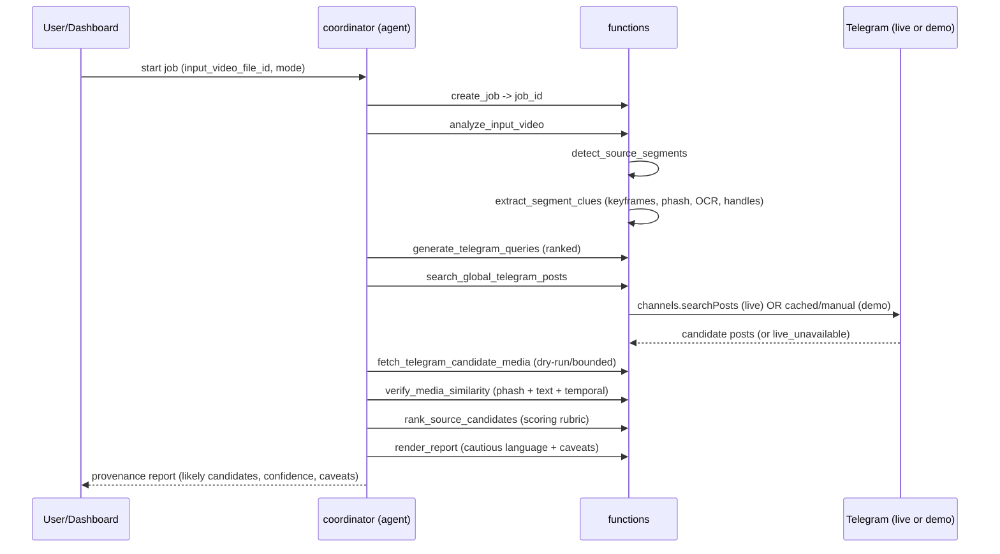

# Architecture

## Product goal
Given an **edited video**, find **likely Telegram source candidates** for its
**reused footage segments**, and produce a **provenance report** with timestamps,
Telegram links, confidence scores, evidence, and caveats — for human
verification. Never claims to have found "the original".

## Why Sinas resources are split the way they are
- **Functions** = deterministic pipeline steps with JSON in/out (testable,
  replaceable, individually executable / async-pollable).
- **Agents** = the reasoning/orchestration layer (Claude) that sequences
  functions, plans queries, and writes the report.
- **Skills** = shared, version-controlled guidance (methodology, scoring rubric,
  report style) injected into agents.
- **Collections** = file storage (videos, keyframes, media, reports).
- **State stores** = structured job/segment/result state across async steps.

## Resources (namespace `clip2trace`)
- Functions: `create_job, diagnose_runtime, analyze_input_video,
  detect_source_segments, extract_segment_clues, generate_telegram_queries,
  search_global_telegram_posts, fetch_telegram_candidate_media,
  verify_media_similarity, rank_source_candidates, render_report`.
- Agents: `coordinator, source-segment-analyst, telegram-query-planner,
  evidence-ranker, report-writer`.
- Skills: `telegram-source-tracing, evidence-scoring-rubric, report-style`.
- Collections: `input-videos, source-segments, keyframes, telegram-media,
  reports, demo-fixtures`.
- Stores: `jobs, segments, search-results, candidate-matches, query-cache,
  runtime-diagnostics`.
- Component: `dashboard`.

## Pipeline sequence

## Why async jobs
Video decode + shot detection + per-candidate media verification can exceed the
**300 s** function timeout. Long steps (`analyze_input_video`,
`detect_source_segments`) run via `POST .../execute/async`; the dashboard polls
`GET /executions/{execution_id}`. Container limits (512 MB RAM, 1 GB disk,
100 MB `/tmp`) force chunked, streaming frame processing — never load a whole
video into memory.

For a **real upload (#36)**, the same long steps first **download** the
`input-videos` file to `/tmp` (via the `sinas` SDK / `host.docker.internal:8000`,
bounded to ~90 MB) before decoding — added latency on top of decode. This is why
those steps must run async (#20) and why their `timeout` must stay ≥ the realistic
download+decode time: the per-execution access token used for the download has a
TTL of `timeout + 5 min`, so too short a `timeout` can expire the token mid-job.
Wiring `/execute/async` + `/executions/{id}` polling in the dashboard is tracked
in **#20** (the unmet "long videos via async" acceptance criterion from #9).

## Why retrieval ≠ proof (and visual verification is the differentiator)
Global Telegram search only *retrieves candidates*. A caption/handle match is
weak alone; a post may be a repost; private/deleted posts are invisible.
Therefore the **scoring is dominated by visual similarity (40%)** and every
output carries caveats. Visual verification — not search — is what makes a
clip2trace result trustworthy.

## Function/library split (runtime reality)
Sinas function bodies run in a sandbox limited to admin-approved packages and
**cannot import this repo's `src/clip2trace`**. So:
- the **deployable** function code is the inline `code:` in `sinas-package.yaml`
  (self-contained);
- `src/clip2trace/` is the **tested reference library** (scoring, matching,
  query generation, report) used by tests and local scripts;
- `functions/*.py` are dev copies that import the library for readability, with
  a self-contained fallback. Keep the YAML inline blocks authoritative, or
  publish `clip2trace` as an approved dependency.
